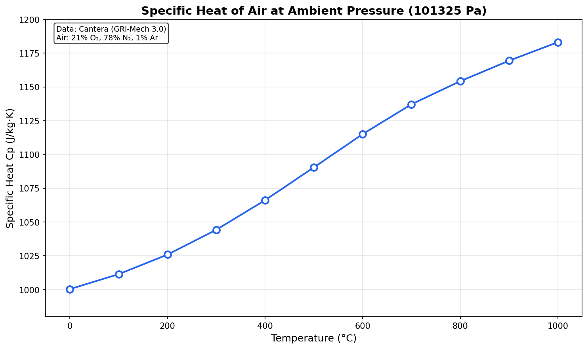

# Example 2: Plotting Specific Heat vs Temperature

This example demonstrates how to use the Cantera MCP Server to calculate and plot the specific heat of air across a range of temperatures.

---

## Scenario

We want to **plot the specific heat of air at ambient pressure for temperatures between 0 and 1000°C at 25°C intervals**.

---

## User Prompt

> Plot the specific heat of air at ambient pressure for temperatures between 0 and 1000°C at 25°C intervals.

---

## Server Workflow

The server performs the following steps:

1. **Creates air mixtures** at each temperature point using `create_lab_mixture`
2. **Retrieves properties** for each mixture using `get_mixture_properties`
3. **Extracts Cp values** from the thermodynamic properties
4. **Generates a plot** showing Cp vs Temperature

### Sample Server Output (at selected temperatures)

```
Mixture Properties for 'air_0C':
=== Thermodynamic State ===
Temperature:           273.15 K
Specific Cp (mass):    1000.3440 J/(kg·K)
...

Mixture Properties for 'air_500C':
=== Thermodynamic State ===
Temperature:           773.15 K
Specific Cp (mass):    1090.4126 J/(kg·K)
...

Mixture Properties for 'air_1000C':
=== Thermodynamic State ===
Temperature:           1273.15 K
Specific Cp (mass):    1183.0391 J/(kg·K)
```

---

## Generated Plot



---

## Data Table

| Temperature (°C) | Temperature (K) | Cp (J/kg·K) |
|------------------|-----------------|-------------|
| 0 | 273.15 | 1000.34 |
| 100 | 373.15 | 1011.42 |
| 200 | 473.15 | 1025.88 |
| 300 | 573.15 | 1044.23 |
| 400 | 673.15 | 1066.14 |
| 500 | 773.15 | 1090.41 |
| 600 | 873.15 | 1115.02 |
| 700 | 973.15 | 1137.10 |
| 800 | 1073.15 | 1154.20 |
| 900 | 1173.15 | 1169.34 |
| 1000 | 1273.15 | 1183.04 |

---

## Key Observations

1. **Cp increases with temperature** - The specific heat rises from ~1000 J/(kg·K) at 0°C to ~1183 J/(kg·K) at 1000°C (an 18% increase)

2. **Non-linear relationship** - The curve shows a slightly non-linear trend due to the temperature dependence of molecular vibrations

3. **NIST accuracy** - Values are derived from GRI-Mech 3.0 thermodynamic data, validated against NIST standards

---

## Tools Used

1. **`create_lab_mixture`** - Creates air mixtures at each temperature point
2. **`get_mixture_properties`** - Retrieves Cp values from stored mixtures

---

## Notes

- Air composition: O₂ (21%), N₂ (78%), Ar (1%) by mole fraction
- Pressure: 101325 Pa (ambient)
- Mechanism: GRI-Mech 3.0 (`gri30.yaml`)
- The increase in Cp at higher temperatures is due to the activation of vibrational degrees of freedom in diatomic molecules (N₂, O₂)
