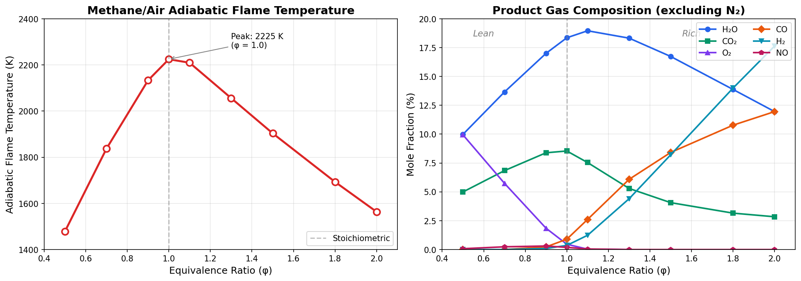

<!-- Copyright Step Function, 2026 -->
# Example 3: Methane/Air Combustion Analysis

This example demonstrates how to use the Cantera MCP Server to calculate and plot adiabatic flame temperatures and product gas compositions for methane/air combustion across a range of equivalence ratios.

---

## User Prompt

> Plot the adiabatic flame temperature and product gas composition in mole fractions for methane/air combustion for equivalence ratios between 0.1 and 2.0.

---

## Server Workflow

The server performs the following steps:

1. **Calculates adiabatic flame temperature** at each equivalence ratio using `calculate_adiabatic_flame_temperature`
2. **Extracts product compositions** from the equilibrium results
3. **Generates two-panel plot** showing temperature and composition vs φ

### Sample Server Output

**Stoichiometric (φ = 1.0):**
```
Adiabatic Flame Temperature Calculation:

=== Combustion Setup ===
Mechanism:          gri30.yaml
Fuel:               CH4:1.0
Oxidizer:           O2:1.0, N2:3.76
Equivalence ratio:  1.000 (stoichiometric)
Initial temperature: 298.00 K
Pressure:           101325.00 Pa (1.0132 bar)

=== Results ===
Adiabatic flame temperature: 2224.54 K (1951.39 °C)

=== Major Product Species (X > 0.1%) ===
  H2: 0.3591%
  O2: 0.4604%
  OH: 0.2862%
  H2O: 18.3495%
  CO: 0.8951%
  CO2: 8.5405%
  NO: 0.1880%
  N2: 70.8611%
```

**Rich (φ = 1.5):**
```
=== Results ===
Adiabatic flame temperature: 1903.42 K (1630.27 °C)

=== Major Product Species (X > 0.1%) ===
  H2: 8.2129%
  H2O: 16.7284%
  CO: 8.4143%
  CO2: 4.0632%
  N2: 62.5536%
```

---

## Generated Plot



---

## Data Summary

| φ | T_ad (K) | H₂O (%) | CO₂ (%) | O₂ (%) | CO (%) | H₂ (%) | NO (%) |
|---|----------|---------|---------|--------|--------|--------|--------|
| 0.5 | 1479 | 9.98 | 4.99 | 9.94 | 0.00 | 0.00 | 0.07 |
| 0.7 | 1837 | 13.65 | 6.84 | 5.74 | 0.00 | 0.00 | 0.24 |
| 0.9 | 2133 | 17.00 | 8.38 | 1.85 | 0.23 | 0.09 | 0.31 |
| **1.0** | **2225** | **18.35** | **8.54** | **0.46** | **0.90** | **0.36** | **0.19** |
| 1.1 | 2209 | 18.96 | 7.54 | 0.03 | 2.61 | 1.24 | 0.05 |
| 1.3 | 2056 | 18.32 | 5.29 | 0.00 | 6.09 | 4.41 | 0.00 |
| 1.5 | 1903 | 16.73 | 4.06 | 0.00 | 8.41 | 8.21 | 0.00 |
| 1.8 | 1693 | 13.87 | 3.16 | 0.00 | 10.78 | 13.99 | 0.00 |
| 2.0 | 1564 | 11.95 | 2.84 | 0.00 | 11.95 | 17.63 | 0.00 |

---

## Key Observations

1. **Peak temperature at stoichiometric** - Maximum T_ad = 2225 K occurs at φ = 1.0

2. **Lean combustion (φ < 1):**
   - Excess O₂ in products
   - Higher NO formation (peaks near φ = 0.9)
   - Complete conversion to CO₂ and H₂O

3. **Rich combustion (φ > 1):**
   - No excess O₂
   - Significant CO and H₂ in products (incomplete combustion)
   - NO formation drops to zero

4. **Product trends:**
   - H₂O peaks near stoichiometric
   - CO₂ peaks near stoichiometric, decreases in rich mixtures
   - CO and H₂ increase monotonically with φ in rich region

---

## Tools Used

- **`calculate_adiabatic_flame_temperature`** - Computes equilibrium combustion products and flame temperature

---

## Notes

- Mechanism: GRI-Mech 3.0 (`gri30.yaml`) - 53 species, 325 reactions
- Initial conditions: 298 K, 101325 Pa
- Air composition: O₂:1.0, N₂:3.76 (21% O₂ by volume)
- Equilibrium solver accounts for dissociation at high temperatures
