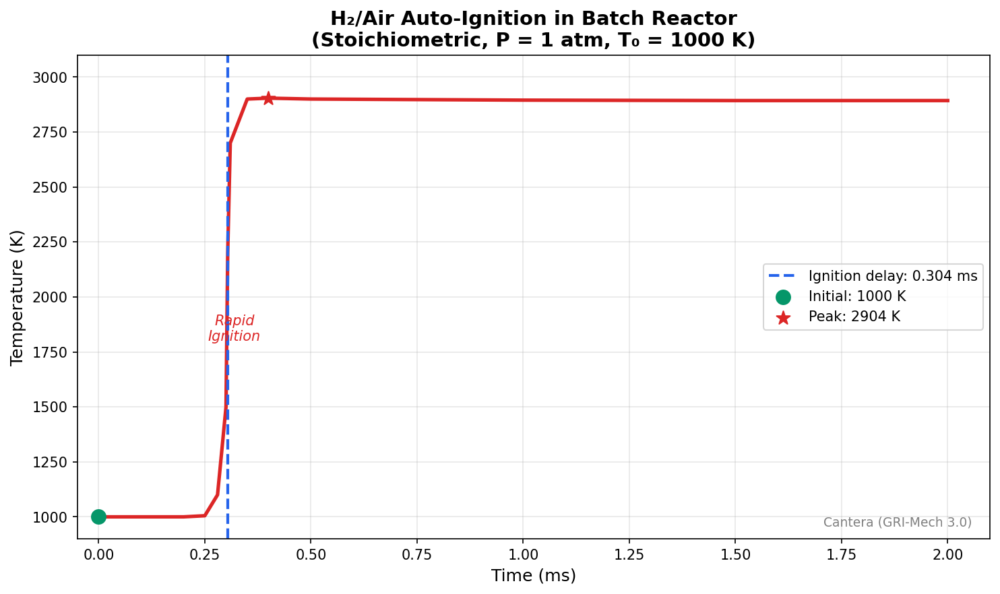

# Example 4: Hydrogen/Air Batch Reactor Ignition

This example demonstrates how to use the Cantera MCP Server to simulate auto-ignition of a hydrogen/air mixture in a batch reactor and determine the ignition delay time.

---

## User Prompt

> Simulate a batch reactor for a Hydrogen/Air mix at 1000K. Tell me the time to ignition and the peak temperature. Also, plot the temperature versus time.

---

## Server Workflow

The server performs the following steps:

1. **Creates stoichiometric H₂/air mixture** at 1000 K using `create_lab_mixture`
2. **Computes ignition delay** using `compute_ignition_delay` (max dT/dt criterion)
3. **Runs batch reactor simulation** using `run_batch_reactor`
4. **Generates temperature vs time plot**

---

## Server Response

### Step 1: Create Mixture

```
Created mixture 'h2_air_1000K' on lab bench:

=== State ===
Mechanism:   gri30.yaml
Temperature: 1000.00 K
Pressure:    101325.00 Pa (1.0132 bar)
Density:     0.254842 kg/m³

=== Composition (mole fractions > 0.1%) ===
  H2: 29.5858%
  O2: 14.7929%
  N2: 55.6213%

=== Kinetics ===
Number of species:   53
Number of reactions: 325
```

### Step 2: Compute Ignition Delay

```
### Auto-Ignition Analysis

**Ignition Delay Time:** 3.0416e-04 seconds (0.304 ms)

- Initial Temperature: 1000.0 K
- Final Temperature: 1402.1 K
- Temperature Rise: 402.1 K
- Max dT/dt: 1.26e+08 K/s
```

### Step 3: Run Batch Reactor

```
### Batch Reactor Simulation (2 ms)
Initial T: 1000.0 K, P: 1.013 bar

| Time (ms) | Temp (K) | H₂ (%) | O₂ (%) | N₂ (%) |
|-----------|----------|--------|--------|--------|
| 0.00      | 1000     | 29.6   | 14.8   | 55.6   |
| 0.22      | 1000     | 29.6   | 14.8   | 55.6   |
| 0.44      | 2904     | 4.4    | 1.4    | 62.3   |
| 0.67      | 2898     | 4.5    | 1.4    | 62.1   |
| 2.00      | 2893     | 4.6    | 1.3    | 62.0   |

Final T: 2893 K (ΔT = 1893 K)
```

---

## Generated Plot



---

## Key Results

| Parameter | Value |
|-----------|-------|
| Initial Temperature | 1000 K |
| **Ignition Delay** | **0.304 ms** |
| **Peak Temperature** | **2904 K** |
| Temperature Rise | 1904 K |
| Max dT/dt | 1.26×10⁸ K/s |
| H₂ Consumed | 29.6% → 4.4% |

---

## Key Observations

1. **Very short ignition delay** - At 1000 K, H₂/air ignites in ~0.3 ms due to fast radical chain-branching reactions

2. **High peak temperature** - Adiabatic combustion reaches ~2900 K, characteristic of hydrogen's high energy density

3. **Rapid transition** - Temperature rises from 1000 K to 2900 K in less than 0.2 ms

4. **Equilibrium products** - Final state shows ~4.5% residual H₂ and O₂ due to dissociation at high temperature

---

## Tools Used

- **`create_lab_mixture`** - Creates the fuel/oxidizer mixture at specified conditions
- **`compute_ignition_delay`** - Calculates ignition delay using max dT/dt criterion
- **`run_batch_reactor`** - Simulates constant-pressure reactor evolution

---

## Notes

- Mechanism: GRI-Mech 3.0 (53 species, 325 reactions)
- Stoichiometric H₂/air: H₂:2, O₂:1, N₂:3.76
- Ignition delay defined as time of maximum temperature rise rate (dT/dt)
- High residual H₂/O₂ at equilibrium is due to dissociation at ~2900 K
